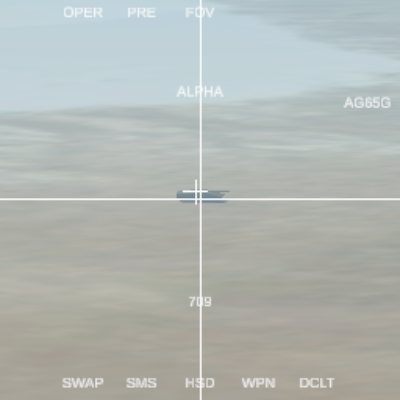

# Sunday Challenge: Maverick TV Missile
On Sundays, I sometimes like to do a mini-challenge to rapidly prototype out some technology or mechanic that I've been thinking about.

For this challenge, I wanted to make multiple missiles with a camera on the nose that points towards a target, along with some basic symbology. This video feed needs to be represented in a cockpit display, so it's going to have to use some kind of render texture.

If you'd like to see the stream where I worked on it, [you can check it out on YouTube here](https://www.youtube.com/watch?v=9W6JiTjIopI)

Built in **Unity 2019.4.8f1**.

## Disclaimer!
*This code is **not** meant to be used as a good example for how to do anything. It is exploratory and prototypical in nature. There **will** be bugs and bad coding practices!*

# Controls

The main camera view is controlled by the `SimpleCameraController` script that comes in new Unity projects.

### Camera
* Hold RMB to pan
* WASDQE for movement
* Scroll wheel to adjust speed

### Missiles
* R: Cycles between missiles
* T: Cycles between targets
* Space: Fire missile
