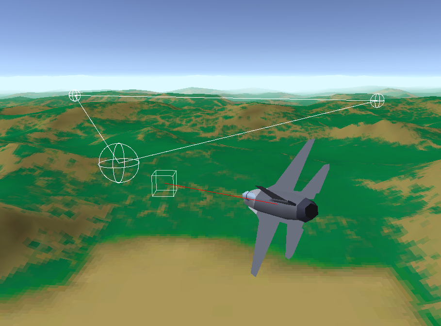

# Sunday Challenge: Sim-lite Flight Physics

On Sundays, I sometimes like to do a mini-challenge to rapidly prototype out some technology or mechanic that I've been thinking about.

For this challenge, I wanted to write some simple flight simulator physics evocative of the sim-lite style physics that the early Jane's games had. They are a good balance of arcade style responsiveness and accessibility, but still have some realistic mechanics such as gravity and corner airspeed.

Built in **Unity 2019.4.8f1**.

## Flight Model Features
* Does not use Unity Rigidbody physics
* Easily understandable and tunable properties
* Responsive and intuitive reactions to stick and rudder inputs
* Max turn rate depending on airspeed
* G-limited turns at high speed
* Configurable angle of attack
* Aerodynamics limited turns at low speed
* Corner airspeed (created by combination of the above two) to encourage speed control
* Afterburner with throttle detent
* When flying near stall speed, velocity vector starts to drop
* When flying below stall speed, the nose starts to drop and control is lost
* Deployable flaps to will lower stall speed to enable low speed flight at the cost of increased drag
* Airbrake increases drag and slows the aircraft down
* Deployable landing gear allows for basic ground handling and increased drag
* Very basic ground handling (only works correctly **flat ground!**)
* Very simple collision detection and handling

## Simple Waypoint Following AI

In addition to the flight model, on the second stream I wrote some very basic AI. The AI will roll into turns and level out when the waypoint is in front of them. They use the same input and physics as the player. There is no PID controller, so the AI can sometimes oscillate with violent roll inputs.

As long as AI can fly towards a point, they can do almost anything with the AI since it just becomes a matter of telling them what to fly towards.

* Path class along with Editor visualization
* If the AI is assigned a `Path` then it will follow the waypoints of the path.
* If the AI is assigned a `Target` then it will constantly fly towards the target.

## Stream links
If you'd like to see the streams where I worked on this, you can check them out on YouTube:
* [Part 1: Writing the basics](https://youtu.be/AOSNYa2RwLM)
* [Part 2: Review of off-stream work, Q&A, and simple AI](https://youtu.be/MYXIuBEtD-8)

## Disclaimer!
*This code is **not** meant to be used as a good example for how to do anything. It is exploratory and prototypical in nature. There **will** be bugs and bad coding practices!*

# Controls

This project was written with an Xbox One gamepad in mind, using the default Unity input system. There's no guarantee that these buttons will match up with any other controller or joystick.

To activate the afterburner, max out the throttle at 100%, then press the Throttle up (A) button again.

|Input|Button|
|---|---|
|Throttle up|A|
|Throttle down|B|
|Left stick X|Roll|
|Left stick Y|Pitch|
|Triggers|Yaw|
|Landing Gear|G|
|Brakes|B|
|Flaps|F|
