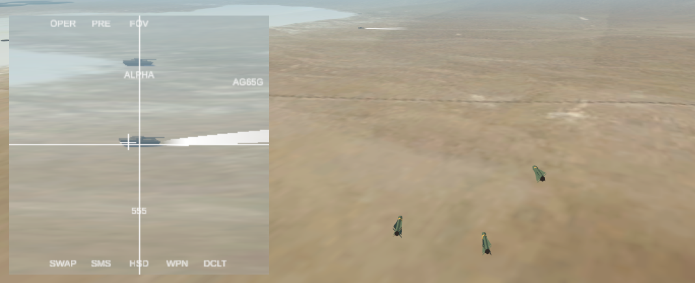
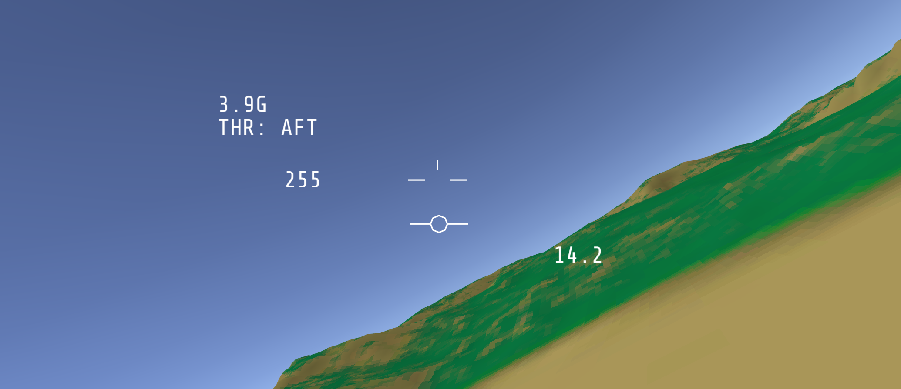

# Sunday Challenges
On Sundays, I sometimes take a break from working on my main project to quickly prototype something simple. A lot of the time, this is a way for me to test an idea that eventually gets rolled into other projects.

A good example of this would be the [Tiny X-Wing project](https://github.com/brihernandez/TinyXWingClean), which was designed to test the idea of loading JSON files that affected gameplay such as ship speed and weapon damage. This project informed a lot of the architecture and design decisions that ultimately led to many features of Tiny Combat Arena becoming driven by external human-readable files.

Some projects might be streamed on my YouTube page. If they are, the associated stream will be linked as well. Click on the `Project Source` link for each project to see more details and the source code.

# Projects

## Maverick

Homing missiles with a TV camera on the nose that can feed some display in a cockpit. Includes passing information into a UI.

* [Project Source](https://github.com/brihernandez/SundayChallenges/tree/master/1.%20Maverick)
* [Stream](https://www.youtube.com/watch?v=9W6JiTjIopI)

## Sim-Lite Flight Physics

Flight physics that strike a medium between arcade and simulator. Loosely based on the physics from the classic Jane's series of flight simulators.

* [Project Source](https://github.com/brihernandez/SundayChallenges/tree/master/2.%20Simlite%20Physics)
* [Stream 1](https://youtu.be/AOSNYa2RwLM)
* [Stream 2](https://youtu.be/MYXIuBEtD-8)
